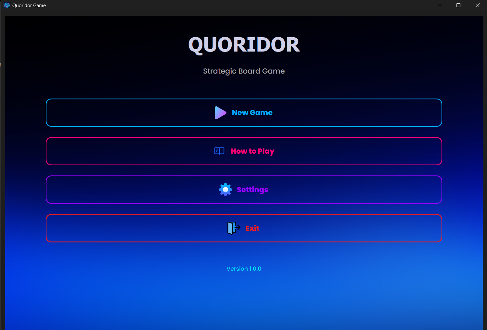
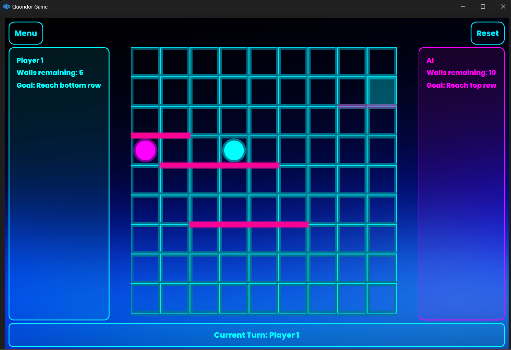
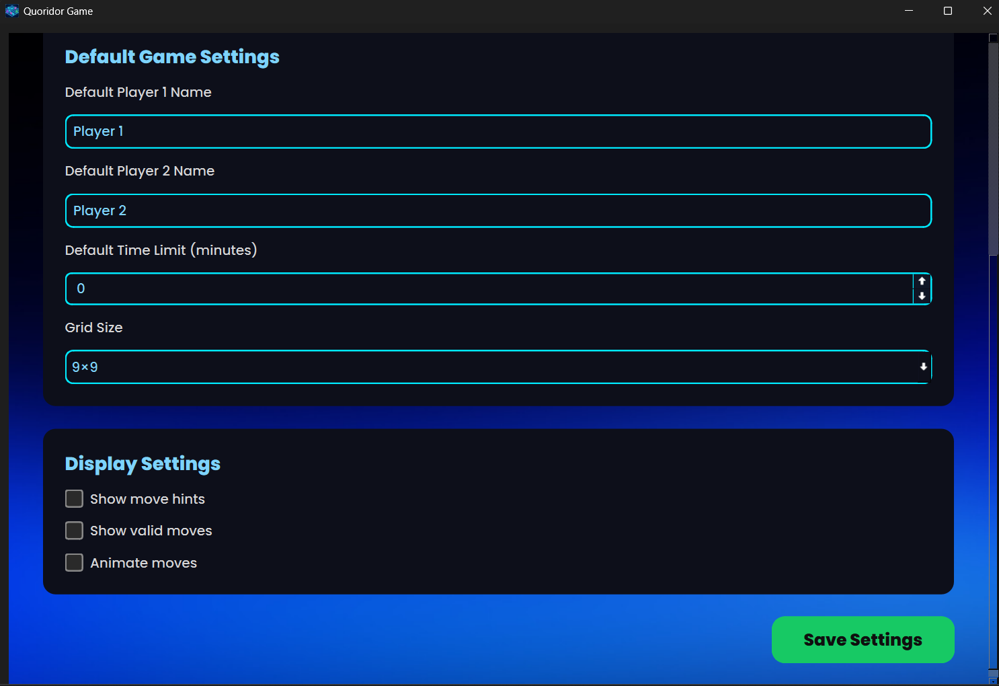

# Quoridor Game

A Python implementation of the **Quoridor** board game using PyQt6 with a modern neon-themed UI.

---

## 📋 Table of Contents

- [Downloads](#-downloads)
- [Demo Video](#-demo-video)
- [Installation (For Developers)](#-installation-for-developers)
- [Running the Application](#-running-the-application)
- [Screenshots](#-screenshots)
- [Game Description](#-game-description)
- [Features](#-features)
- [Game Controls](#-game-controls)
- [Project Structure](#-project-structure)
- [Contributing](#-contributing)
- [License](#-license)

---

## 📥 Downloads

Download the standalone executable for your platform (no Python installation required):

| Platform | Download Link |
|----------|---------------|
| **Windows-Version** | [Download for Windows](https://drive.google.com/drive/u/3/folders/1Zep3NTt-0zvZ1yizKgu8jdgrdo8MjuWA) |
| **Linux-Version** | [Download for Linux](https://drive.google.com/drive/u/3/folders/1Kv25pD3CM3a6cVSJiSRmVRfu5u1dHpL6) |

> Simply download and run - no installation needed!

---

## 🎥 Demo Video

[▶️ Watch the Quoridor Game Demo](https://drive.google.com/drive/u/3/folders/18lqVWyoRwqdQNoWBYTV7BbtboGNJmVMM)

_See the game in action with AI vs human gameplay_

---

## 🔧 Installation (For Developers)

### Prerequisites
- Python 3.8+
- pip

### Method 1: Using Virtual Environment (Recommended)

1. **Clone or navigate to the project directory:**

   ```bash
   cd Quoridor-Game
   ```

2. **Create a virtual environment:**

   - On Windows:
     ```bash
     python -m venv venv
     ```
   - On macOS/Linux:
     ```bash
     python3 -m venv venv
     ```

3. **Activate the virtual environment:**

   - On Windows:
     ```bash
     venv\Scripts\activate
     ```
   - On macOS/Linux:
     ```bash
     source venv/bin/activate
     ```

4. **Install the required dependencies:**
   ```bash
   pip install -r requirements.txt
   ```

### Method 2: Without Virtual Environment

1. **Navigate to the project directory:**

   ```bash
   cd Quoridor-Game
   ```

2. **Install the required dependencies globally:**
   ```bash
   pip install -r requirements.txt
   ```
   > **Note:** Installing packages globally may require administrator privileges and can potentially conflict with other Python projects. Using a virtual environment is recommended.

## 🚀 Running the Application

1. **Ensure you're in the project directory:**

   ```bash
   cd Quoridor-Game
   ```

2. **If using virtual environment, activate it (if not already activated):**

   - On Windows: `venv\Scripts\activate`
   - On macOS/Linux: `source venv/bin/activate`

3. **Run the application:**
   ```bash
   python main.py
   ```

The Quoridor game window should open, displaying the main menu.

---

## 📸 Screenshots

| Main Menu | Gameplay |
|-----------|----------|
|  |  |

| Setup Screen | Settings |
|--------------|----------|
|  |  |

| Victory Screen |
|----------------|
|  |

---

## 🎮 Game Description

Quoridor is a strategic board game where two players race to reach the opposite side of a 9×9 grid while placing walls to block their opponent's path.

### Objective

- **Player 1 (Cyan):** Start at the bottom center and reach the top row
- **Player 2 (Magenta):** Start at the top center and reach the bottom row
- First player to reach the opposite side wins!

### Core Rules

| Rule | Description |
|------|-------------|
| **Movement** | Move one square horizontally/vertically (not diagonally) |
| **Walls** | Each player has 10 walls to place strategically |
| **Jumping** | Jump over an adjacent opponent if unblocked |
| **Path Requirement** | A path must always remain for each player to reach their goal |

---

## ✨ Features

- **Neon-Themed UI** — Modern cyan and magenta aesthetic
- **Human vs Human** — Play locally with another person
- **Human vs AI** — Three difficulty levels:
  - Easy: 1-level minimax
  - Medium: 2-level minimax
  - Hard: 3-level minimax with alpha-beta pruning
- **Responsive Board** — Dynamically scales to window size
- **Wall Validation** — Ensures no player is completely blocked
- **Customizable Games** — Board size (9×9, 11×11, 13×13), time limits
- **Settings Panel** — Sound, move hints, animations preferences
- **How to Play** — In-game guide with rules and strategy tips

---

## 🎮 Game Controls

### Main Menu
- **New Game**: Configure and start a new game
- **How to Play**: View rules and strategy tips
- **Settings**: Customize preferences
- **Exit**: Close the application

### During Gameplay

| Action | Control |
|--------|---------|
| Move Pawn | **Left Click** on valid cell |
| Place Wall | **Right Click** near grid lines |
| Reset Game | Click **Reset** button |
| Return to Menu | Click **Menu** button |

### Game Setup Options
- Player names and AI toggle
- AI difficulty (Easy/Medium/Hard)
- Board size selection
- Time limit per move

---

## 📁 Project Structure

```
Quoridor-Game/
├── main.py                 # Application entry point
├── utils.py               # Utility functions
├── requirements.txt       # Python dependencies
├── game/                  # Core game logic
│   ├── board.py          # Board state and wall management
│   ├── game_state.py     # Game state and move validation
│   ├── player.py         # Player class definition
│   ├── rules.py          # Game rules and legal moves
│   └── pathfinding.py    # BFS pathfinding for wall validation
├── ai/                    # AI player implementation
│   └── ai.py             # Minimax with alpha-beta pruning
├── ui/                    # User interface components
│   ├── main_window.py    # Main window container
│   ├── main_menu.py      # Main menu screen
│   ├── setup_window.py   # Game setup screen
│   ├── game_window.py    # Main gameplay screen
│   ├── board_widget.py   # Interactive game board
│   ├── settings_window.py # Settings panel
│   ├── how_to_play_window.py # Rules and help
│   └── assets/           # Images, fonts, stylesheets
└── tests/                 # Unit tests
    └── test_board.py     # Board logic tests
```

---

## 🤝 Contributing

Feel free to submit issues and pull requests to improve the game!

---

## 📄 License

This project is open-source and available under the MIT License.
